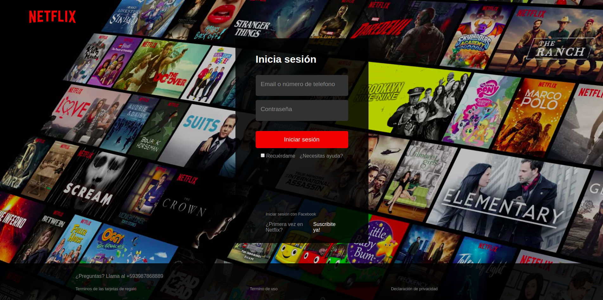
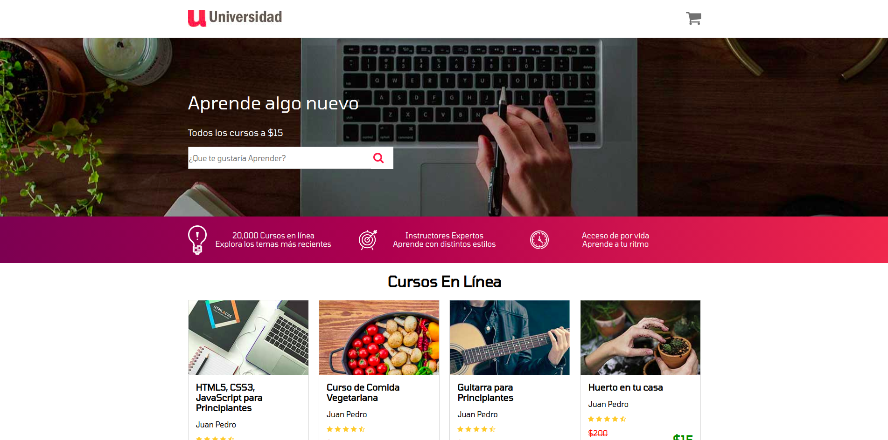
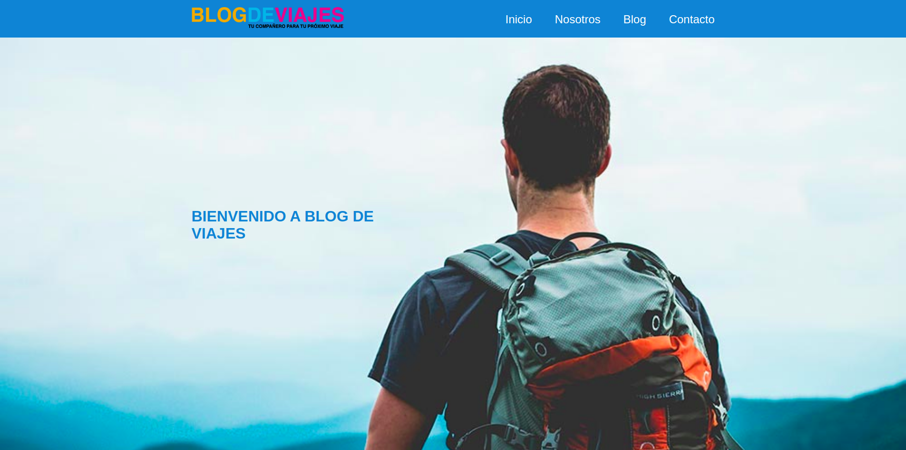
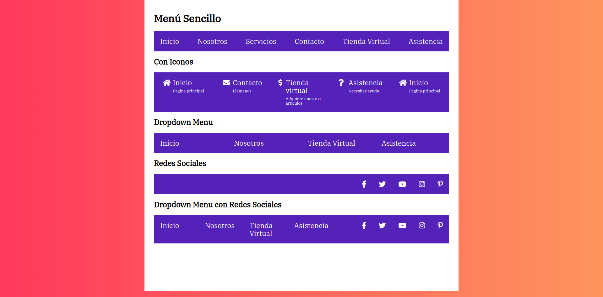

# Ejercicios básicos de Flexbox y Grid CSS

Incluye ejercicios de práctica de Flexbox y Grid CSS con ejemplo de páginas reales.

## Cómo probar 
- Clona el repo 
- [Descarga el complemento para VSCode Go Live](https://marketplace.visualstudio.com/items?itemName=ritwickdey.LiveServer "Go Live Plugin")
- Disfruta aprendiendo! 😁😁
## Screenshots

### Devflix

### Universidad

### Blog Viajes

### Menus

