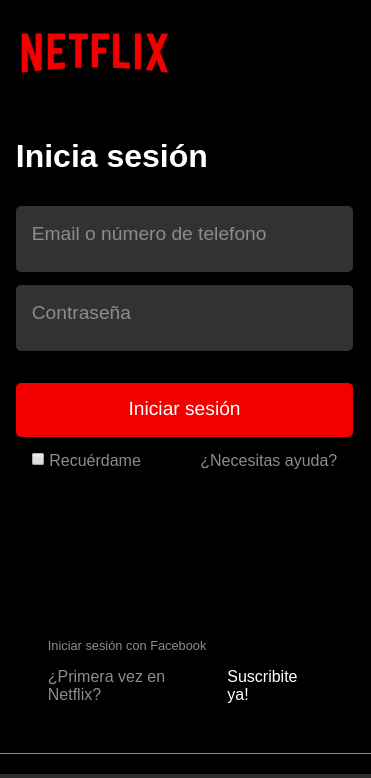
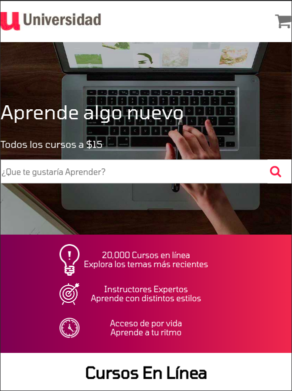
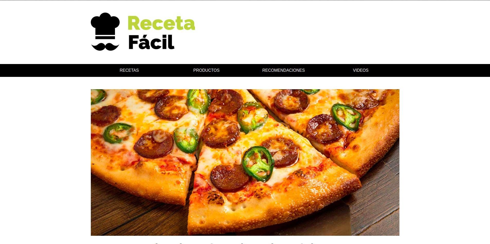
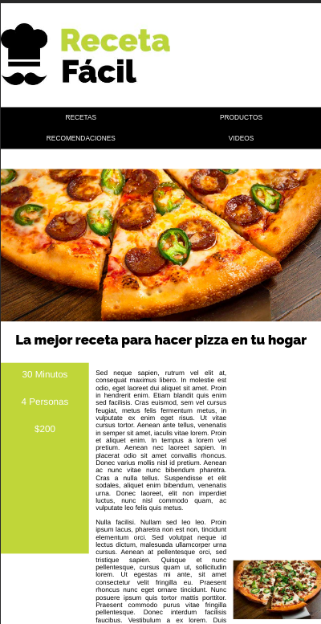
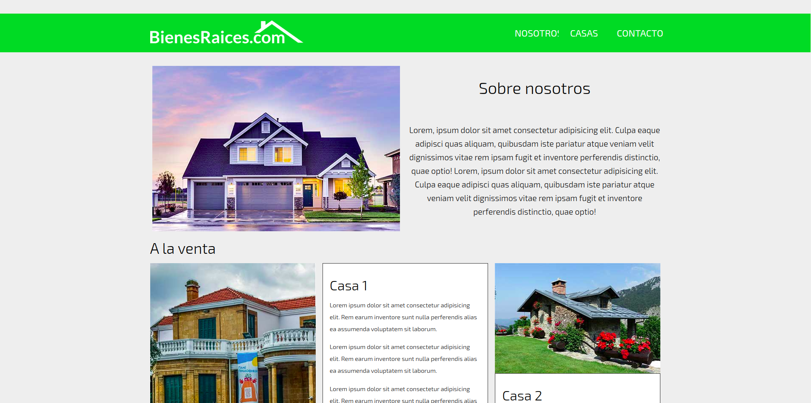

# Ejercicios básicos de Flexbox y Grid CSS

Incluye ejercicios de práctica de Flexbox y Grid CSS con ejemplo de páginas reales.

## Cómo probar 
- Clona el repo 
- [Descarga el complemento para VSCode Go Live](https://marketplace.visualstudio.com/items?itemName=ritwickdey.LiveServer "Go Live Plugin")
- Disfruta aprendiendo! 😁😁
## Screenshots

### Devflix

#### Responsive 

  

### Universidad

#### Responsive 

  

### Blog Viajes

### Menus

### Recetas

  

  

### Bienes Raices

